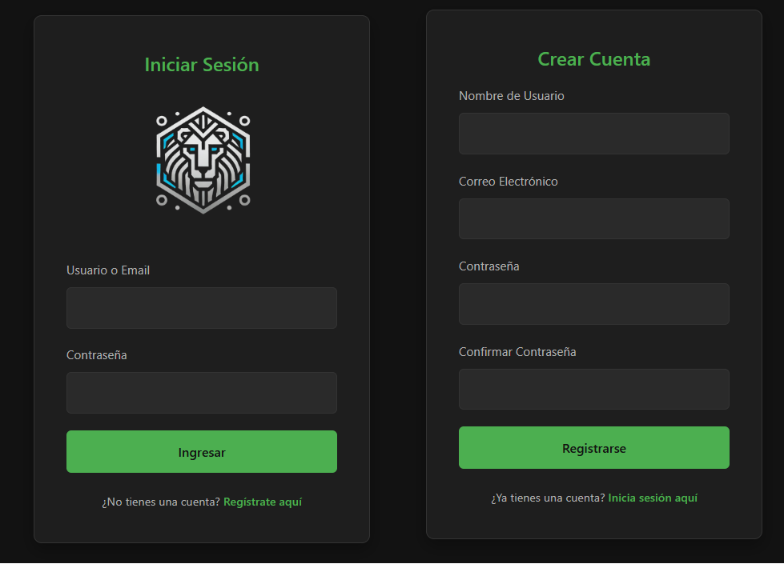

# login-funcional
 
 A secure login and registration system built with modern web technologies.

## System Preview

## ✨Features
* ✅ Complete authentication flow (register/login/dashboard/logout)

* 🔒 Password hashing using PHP's password_hash()

* 🛡️ Session management with security protections

* 📱 Responsive design that works on all devices

* 📝 Form validation (client-side + server-side)

* 🚦 Error handling with user-friendly messages

## ⚡ Quick Start
1. **Clone the repository**

* <code> git clone </code> https://github.com/MarceloDL29/login-funcional.git  

* <code>cd auth-system</code>

2. **Set up the database**

* Import database.sql to your MySQL server

* Configure includes/config.php with your credentials

3. **Launch the application** 

* Access login page at http://localhost/auth-system/index.html

* Register new users at http://localhost/auth-system/register.html

## 🏗️ Project Structure
 
/auth-system/ 
├── public/                  # Frontend files  
│   ├── index.html           # Login page 
│   ├── register.html        # Registration page 
│   └── dashboard.php        # Protected page 
├── includes/                # Backend logic 
│   ├── config.php           # Database configuration 
│   ├── auth_functions.php   # Authentication logic 
│   └── session_manager.php  # Session handling 
└── assets/ 
    ├── css/                 # Stylesheets 
    └── js/                  # Client-side scripts

## 🛠️ Dependencies
* PHP 7.4+

* MySQL 5.7+

* Modern web browser

## 🔧 Troubleshooting

* **Blank pages?** Check PHP error logs

* **Database issues?** Verify credentials in config.php

* **Session problems?** Ensure cookies are enabled

## 🤝 Contributing

### Pull requests are welcome! For major changes, please open an issue first.
